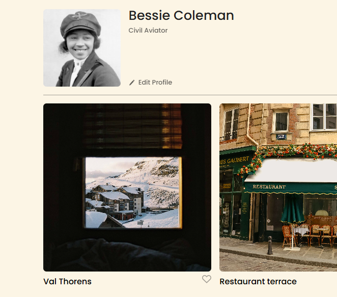
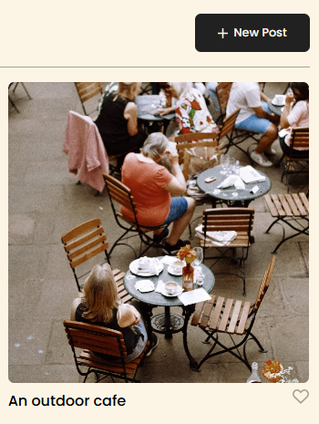
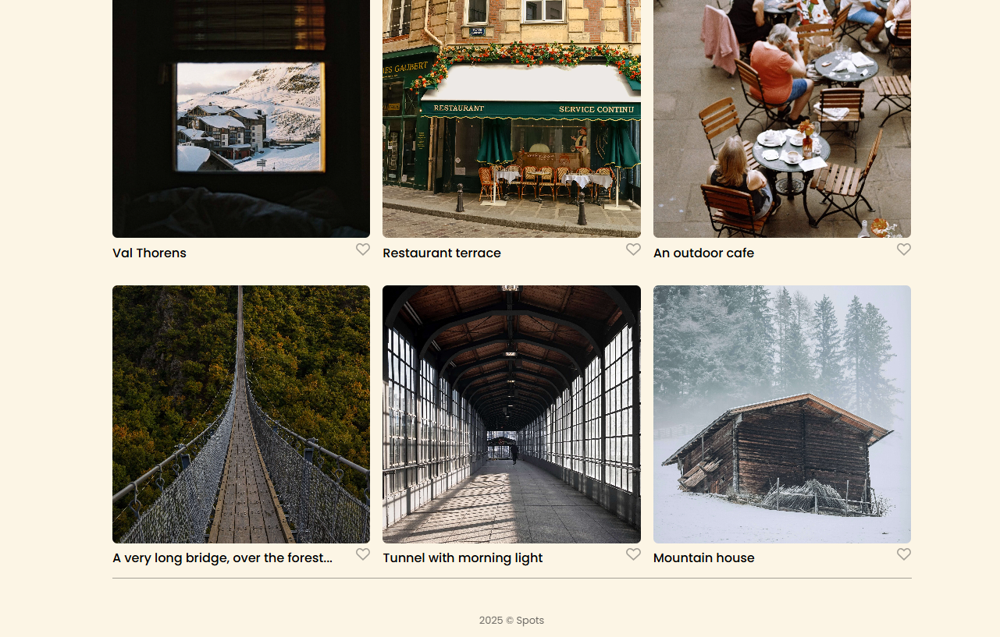

# Project: Spots

### Description 

Spots is an interactive image sharing site that is optimized for large desktops and mobile phone screens. It also features buttons for editing profiles, creating posts, and the ability to like photos.
  
### Technologies & Techniques
  
* HTML
* CSS
* BEM
* Pseudo-class
* CSS Grid Layout
* CSS Flexbox
* Overflow
* White Space
* Responsive Design
* Accessibility
* Visual hierarchy

### Media

### Deployment Link

This webpage is deployed to GitHub Pages.
* [Deployment Link](https://drakemcguire.github.io/se_project_spots/)
  
### Video Summary
* [My video](https://drive.google.com/file/d/1j1hjNIG661fLZ4dFV5_cVEuE5cM63Sgo/view?usp=drive_link)
